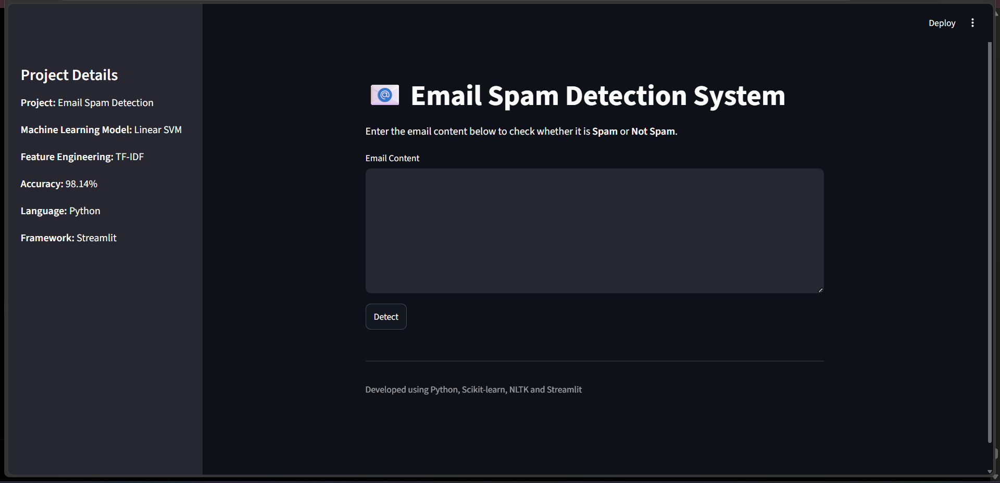
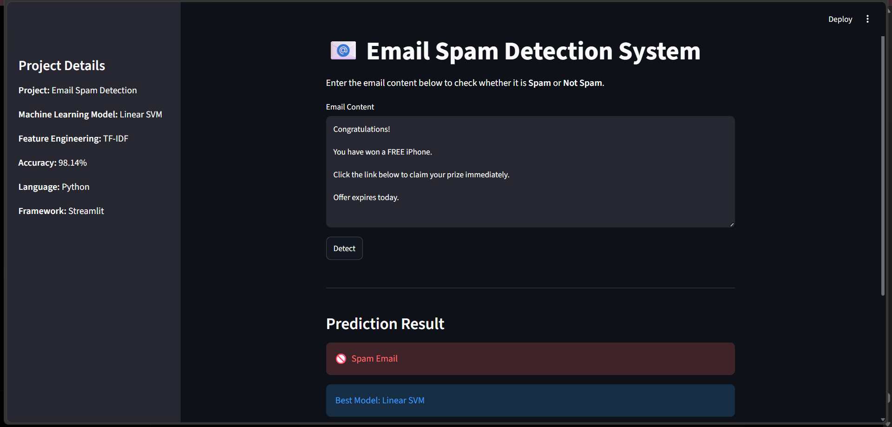
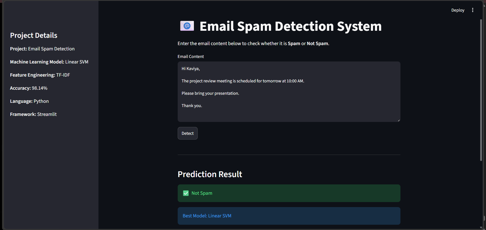

# 📧 Email Spam Detection

## Project Overview

This project is a Machine Learning-based web application that classifies emails as **Spam** or **Not Spam**. It uses Natural Language Processing (NLP) techniques and compares multiple machine learning models to identify the best-performing classifier. The application is built with **Streamlit** for an interactive user interface.

## Features

- Detects Spam and Not Spam emails
- Cleans and preprocesses email text
- Uses TF-IDF for feature extraction
- Trains and compares multiple ML models
- Interactive Streamlit web application
- Displays model comparison and confusion matrix

## Technologies Used

- Python
- Streamlit
- Pandas
- NumPy
- Scikit-learn
- Matplotlib
- NLTK

## Machine Learning Models

- Multinomial Naive Bayes
- Logistic Regression
- Linear SVM
- Random Forest

**Best Performing Model:** Linear SVM

## Project Structure
```
Email-Spam-Detection/
│── app.py
│── train_model.py
│── spam_model.pkl
│── tfidf_vectorizer.pkl
│── email_text.csv
│── confusion_matrix.png
│── model_comparison.png
│── requirements.txt
│── README.md
```
## Installation

```bash
pip install -r requirements.txt
```

## ▶️ Run the Application

```bash
streamlit run app.py
```

## Results

- High accuracy in spam email classification
- Compared four machine learning models
- Selected the best model based on performance metrics

##  Application Screenshots

### Home Page



### Spam Prediction



### Not Spam Prediction



## Future Improvements

- Deploy the application online using Streamlit Community Cloud
- Add support for multiple languages
- Improve prediction explanations
- Integrate deep learning models

##Author

**Kaviya E**

Computer Science and Engineering Student

Aspiring Data Scientist
\- Enhance the user interface with additional features.
